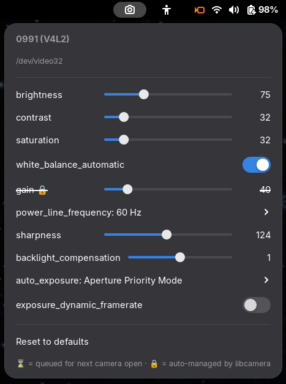
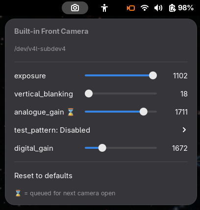
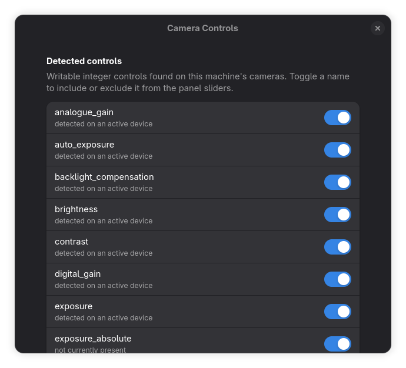

# Camera Controls — GNOME Shell extension

Surfaces v4l2 camera controls (exposure, gain, brightness, auto-exposure, white-balance, …) in the top panel **only while a camera is streaming**. Each control is rendered according to its v4l2 type: integers as sliders, booleans as switches, menus as submenus. Uses WirePlumber GIR bindings for event-driven camera-live detection (no polling) and `v4l2-ctl` for the control plane.

| UVC webcam (v4l2 backend) | Built-in camera (libcamera backend) | Preferences |
|:-:|:-:|:-:|
|  |  |  |
| sliders, switches, submenus — and `🔒` / `⌛` markers for auto-managed or queued controls | libcamera-backed camera with the sensor subdev as the control device, `⌛` on controls the subdev refuses mid-stream | toggle any writable control the camera exposes, or type in a custom name |

See [docs/](docs/) for architecture, detection, device mapping, prereqs, preferences, security, and testing notes.

## Preferences

The set of v4l2 control names the extension renders as sliders is user-configurable via `gnome-extensions prefs camera-controls@cellerier.net`. Detected controls get a switch row; custom names can be added with a free-text entry (validated as lowercase-letter-digit-underscore identifiers).

## License

GPL-3.0-or-later — see [LICENSE](LICENSE).

## Runtime dependencies (Debian/Ubuntu)

```
sudo apt install v4l-utils pipewire wireplumber gir1.2-wp-0.5
```

## Install (for local development)

```
ln -s "$PWD" ~/.local/share/gnome-shell/extensions/camera-controls@cellerier.net
# log out / log in on Wayland (or Alt-F2 → r on X11)
gnome-extensions enable camera-controls@cellerier.net
```
